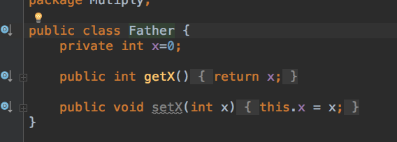
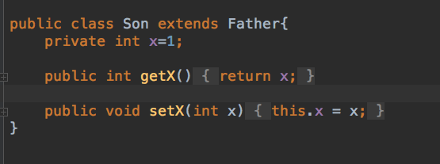
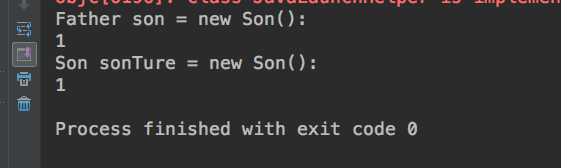

# Mutiply

父类和子类中定义同样的变量会产生什么样子的效果？？







```Java
public class Father{
    private int x = 0;
    
    public int getX()
    {
        return this.x;
    }
    
    public void setX(int x)
    {
        this.x = x;
    }
}
```

```java
public class son{
    private int x=1;
    
    public int getX()
    {
        return this.x;
    }
    
    public void setX(int x)
    {
        this.x = x;
    }
}
```

```java
Father son = new Son();
System.out.println("Father son = new Son():\n"+son.getX());
Son sonTrue = new Son();
System.out.println("Son sonTure = new Son():\n"+son1.getX());
```

```java
result:

Father son = new Son():
1
Son sonTure = new Son():
1
```

从结果中可以看出。不管引用类型是什么类型，调用的都是实例对象的方法。这在Java中就是动态绑定的一种实现。

调用的方法只有在运行时才会被确定，当引用类型和实例不一样的时候，先在实例中找，如果实例中没有改方法，才会调用引用类型中的方法。

如果是子类中有父类中没有的方法，在用父类引用  引用子类对象的时候，如果用父类引用调用子类方法则会报错。因为父类引用虽然引用的是子类实例，但是其实内存分配中，分配到了子类的内存。但指向的只有父类中的这一部分，无法调用到子类所在部分。